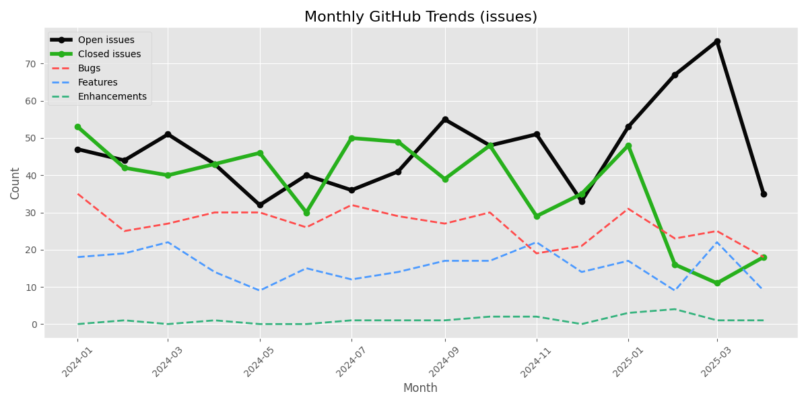
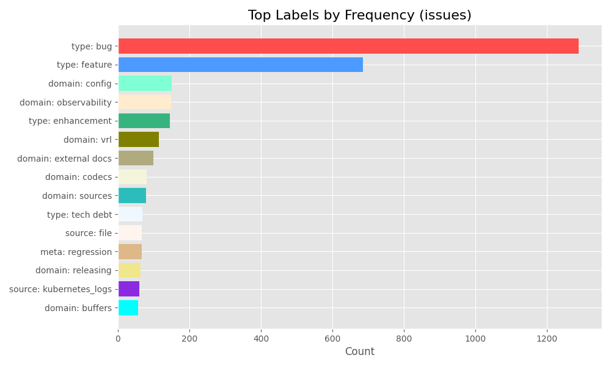
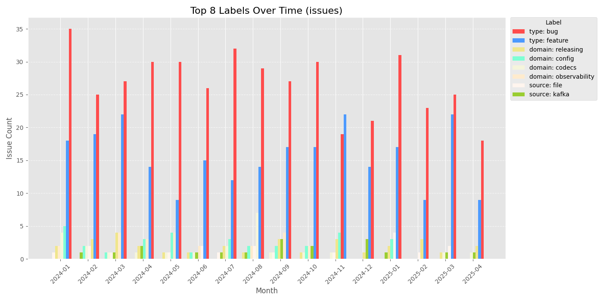
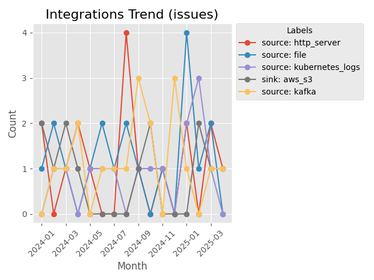
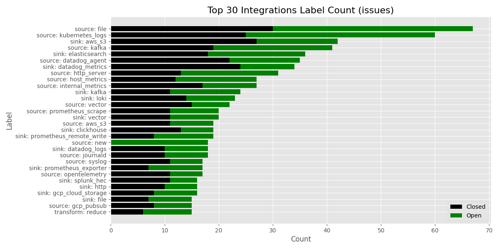
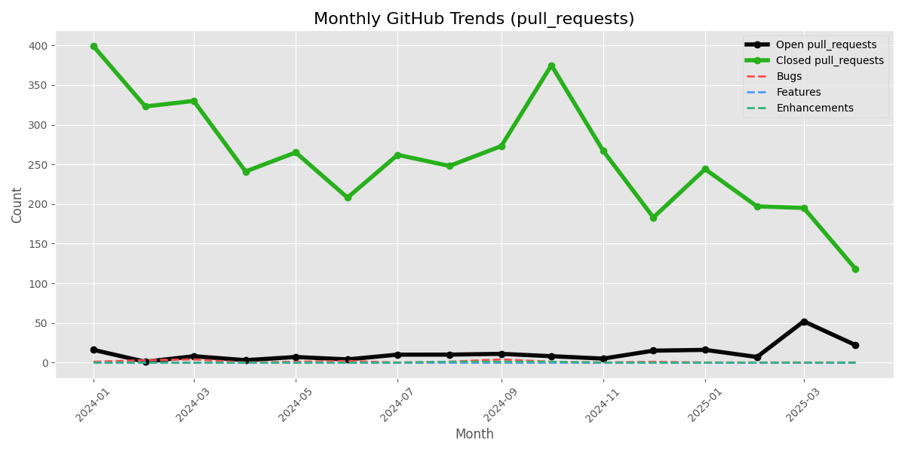
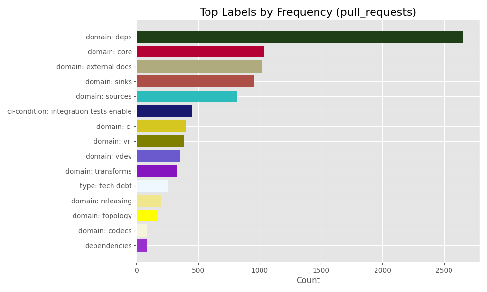
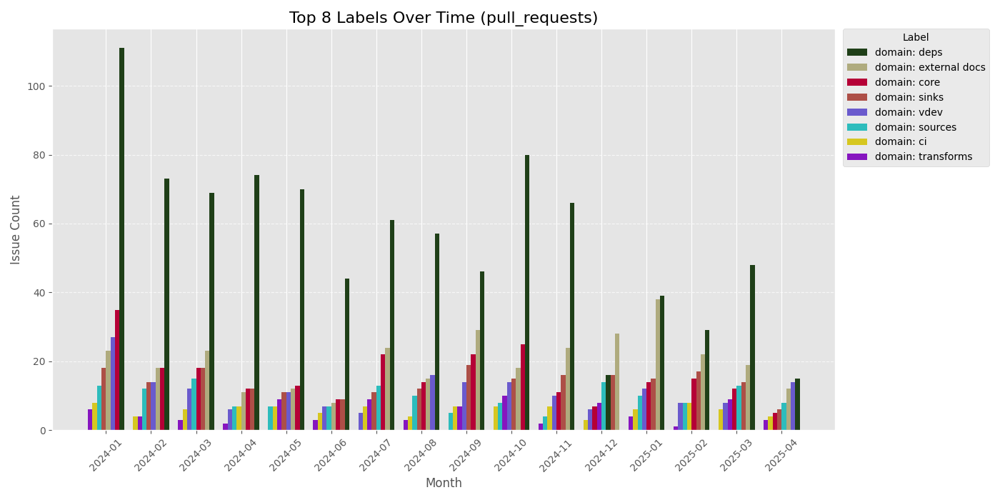
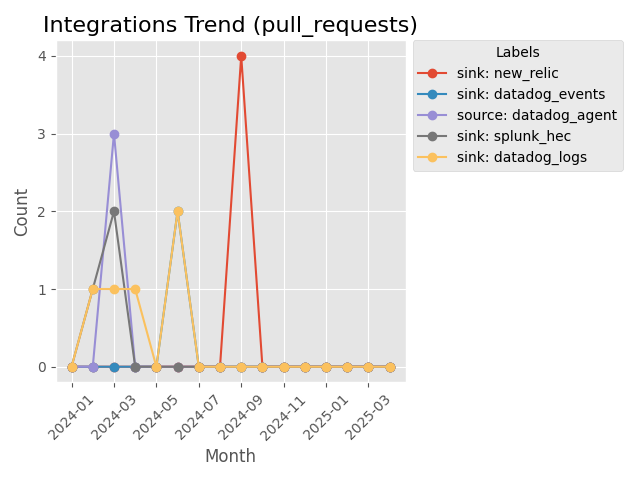

# github-tools

 > [!WARNING]  
> Under Construction. I force push to this frequently.

These are some tools for extracting data for github and saving them for further analysis.

# Configuration

For GitHub integrations, you will need a `.env` file. Example:

```dotenv
GITHUB_TOKEN=REDACTED
REPO_OWNER=vectordotdev
REPO_NAME=vector
```

# Previous Results

Look at the `static` directory. I manually saved some snapshots in there.

# Run

```shell
./run-all.sh
```

## Trends

### Issues






### Pull Requests




