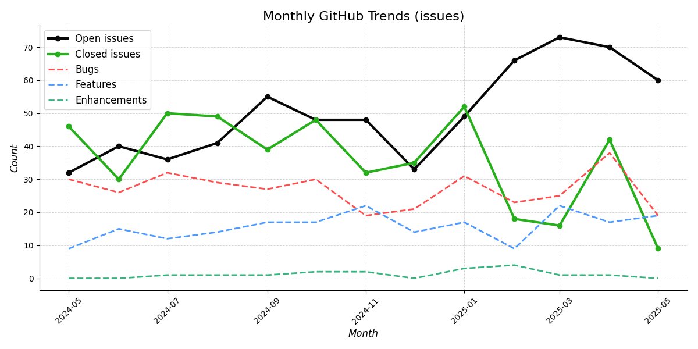
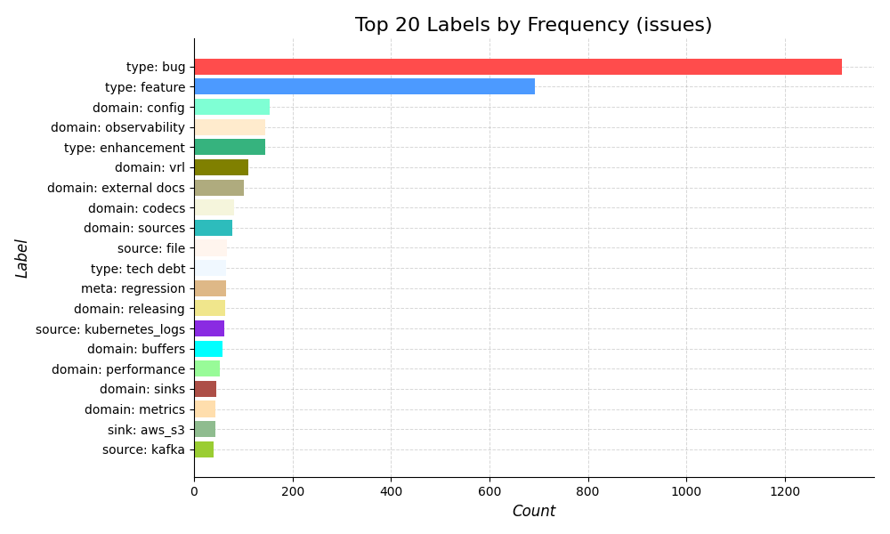
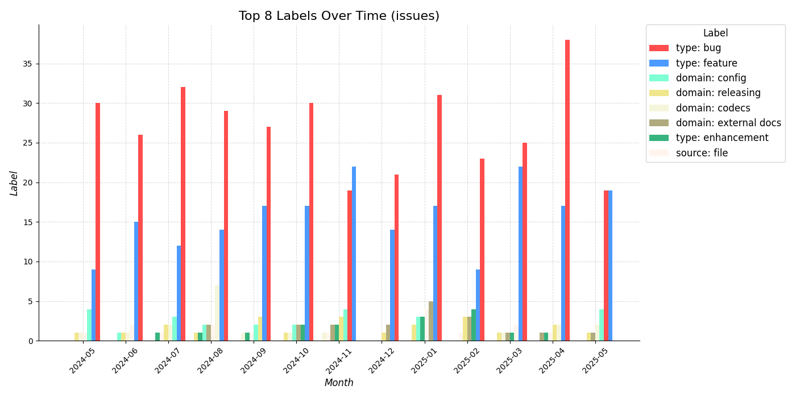
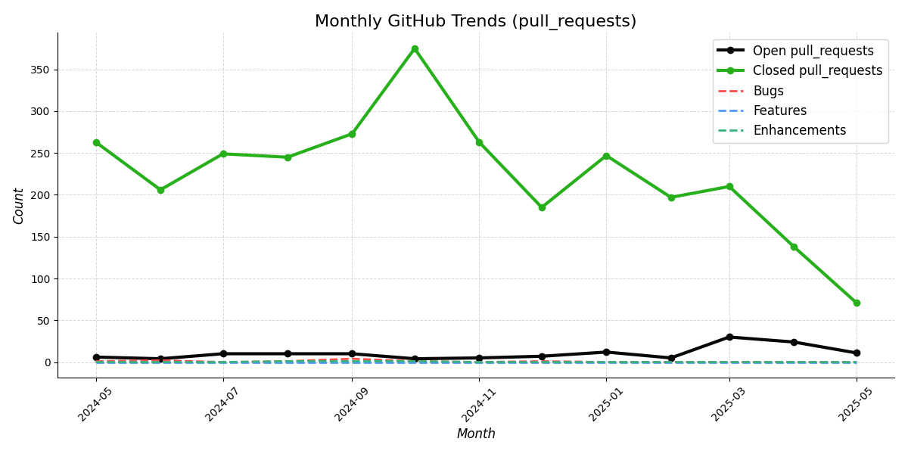
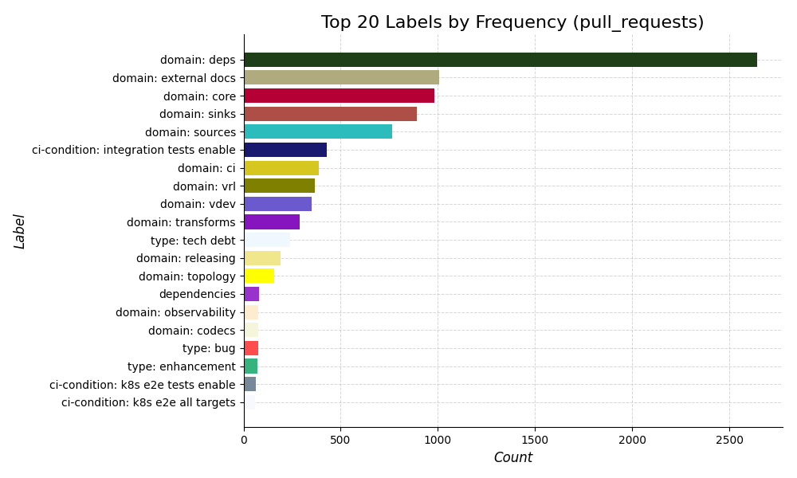
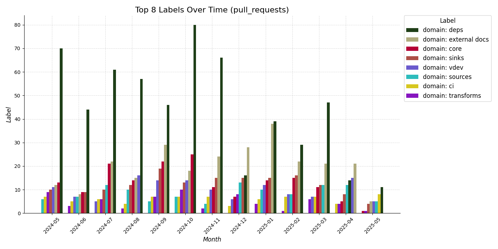

# github-tools

> [!WARNING]  
> Under Construction. I force push to this frequently.


These are some tools for extracting data for GitHub, storing them in a local db, querying them and finally visualizing them.

# Configuration

For GitHub integrations, you will need a `.env` file. Example:

```dotenv
GITHUB_TOKEN=REDACTED
REPO_OWNER=vectordotdev
REPO_NAME=vector
```

# Run

The following script deletes and regenerates everything.

```shell
./run-all.sh path/to/my.env
```

## Trends

### Issues



---



---



---


---


### Pull Requests



---



---



---


---


### Discussions

TODO!
