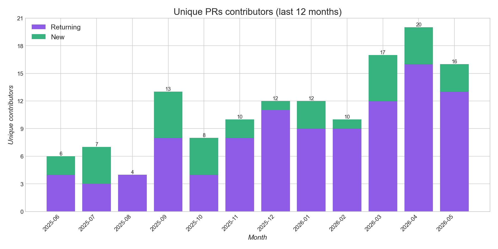
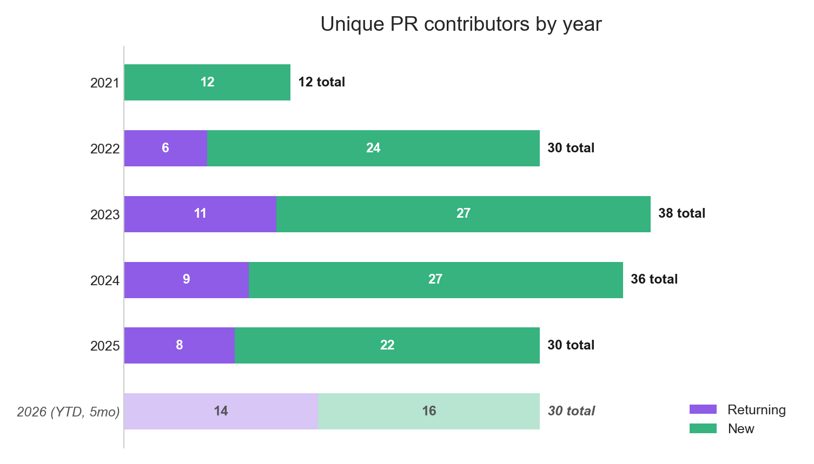

# Quickwit — Trends

[← back to README](../README.md)

## Issues

---

*`no-changelog` and `meta: awaiting author` series hidden.*

---

*`no-changelog` and `meta: awaiting author` series hidden.*

## Pull Requests

*Draft PRs excluded.*

---

*Draft PRs excluded. `no-changelog` and `meta: awaiting author` series hidden.*

---

*Draft PRs excluded. `no-changelog` and `meta: awaiting author` series hidden.*

---

*Draft PRs and known bot accounts excluded.*

---

**Unique PR contributors by year**

<!-- AUTO:yearly-contributors:start -->

| Year | Unique | New | Returning |
|------|--------|-----|-----------|
| 2021 | 12 | 12 | 0 |
| 2022 | 30 | 24 | 6 |
| 2023 | 38 | 27 | 11 |
| 2024 | 36 | 27 | 9 |
| 2025 | 30 | 22 | 8 |
| 2026 (YTD, 5mo) | 30 | 16 | 14 |

<!-- AUTO:yearly-contributors:end -->

*Draft PRs and known bot accounts excluded.*

## Discussions

