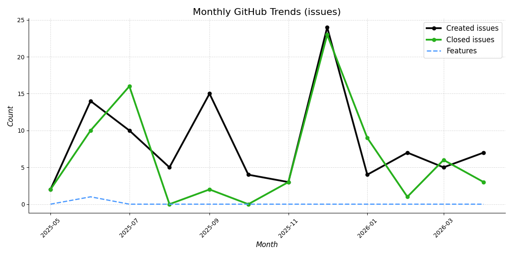
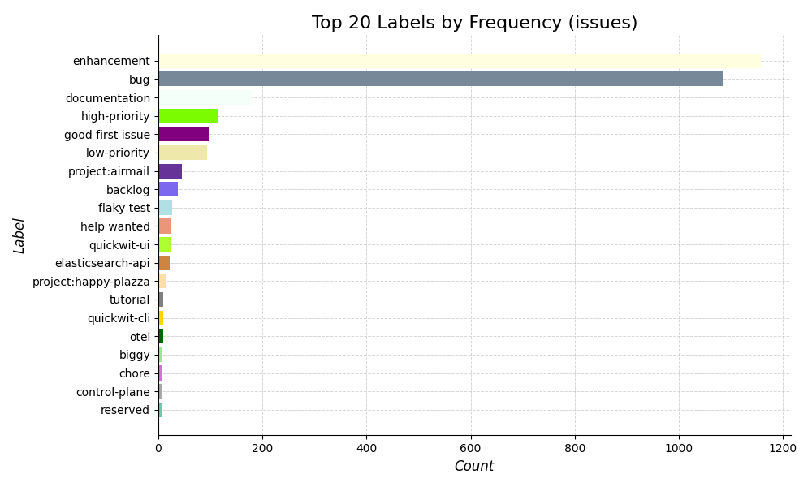
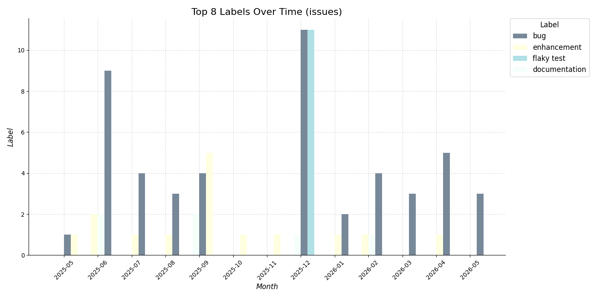
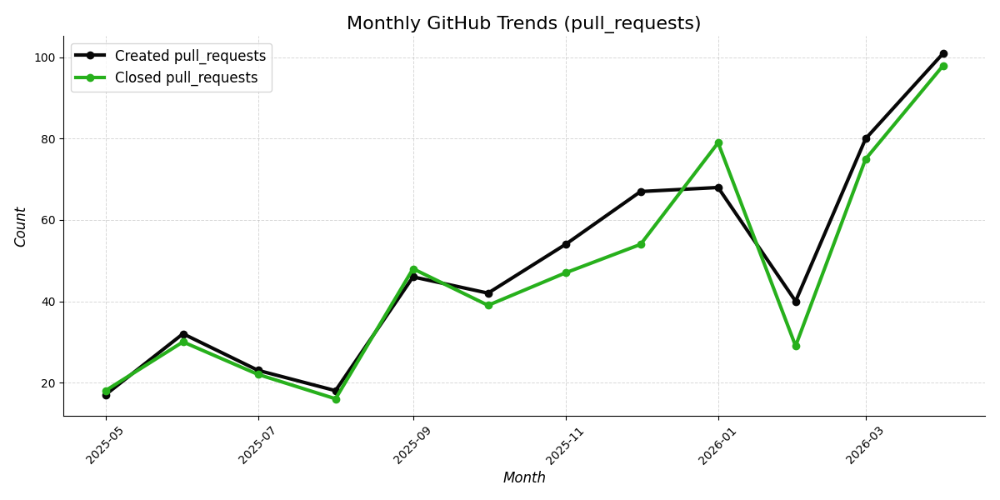
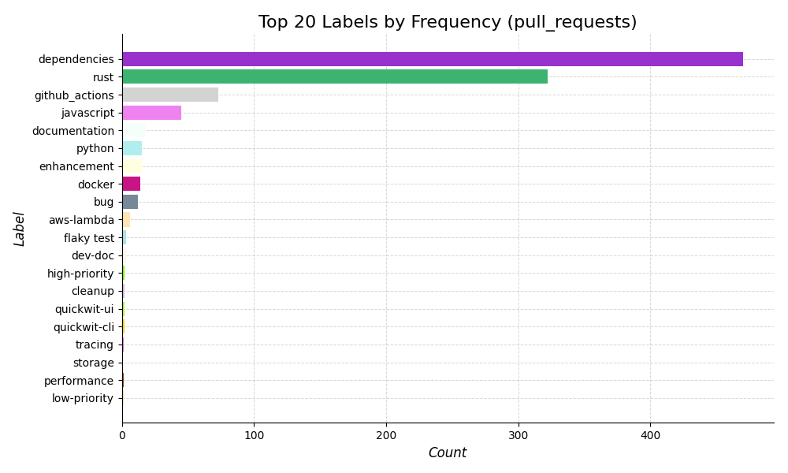
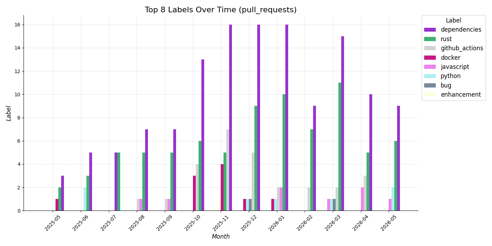
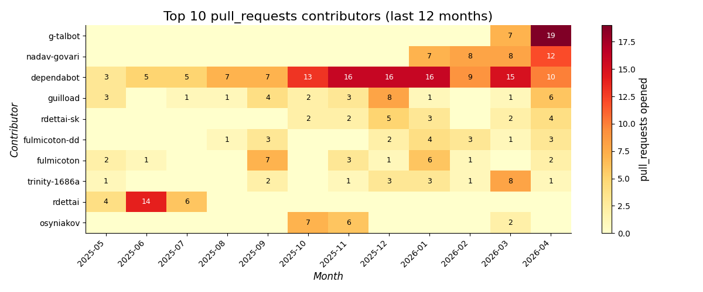
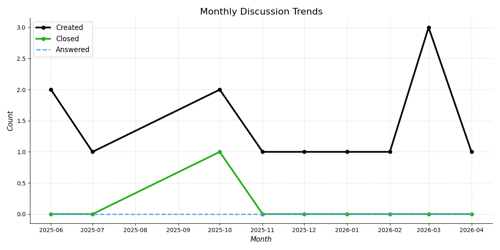

# Quickwit — Trends

> [!NOTE]
> Draft PRs are excluded. Issues and PRs with the following labels are excluded from all charts: `no-changelog`, `meta: awaiting author`.

[← back to README](../README.md)

## Issues

---

---

## Pull Requests

---

---

---

## Discussions

