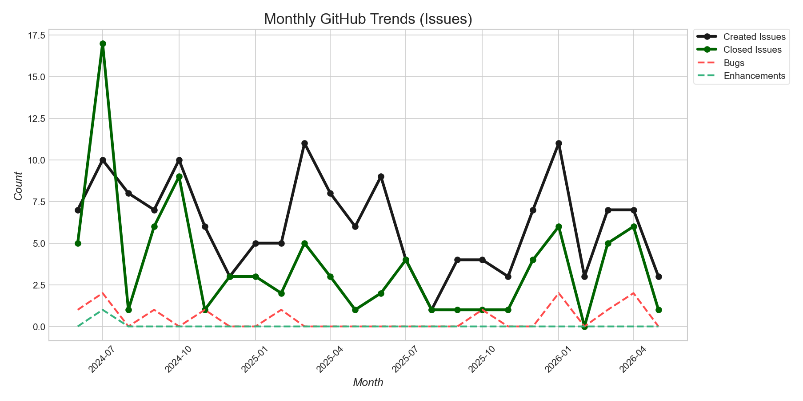
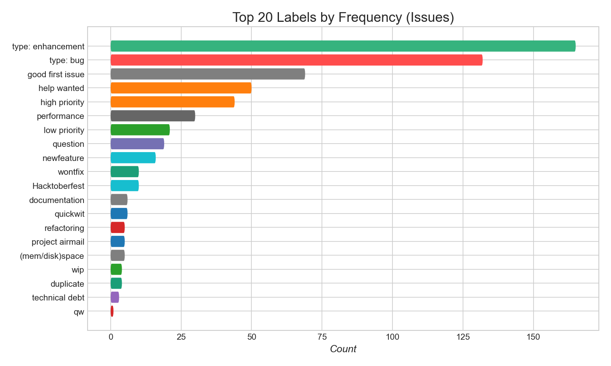
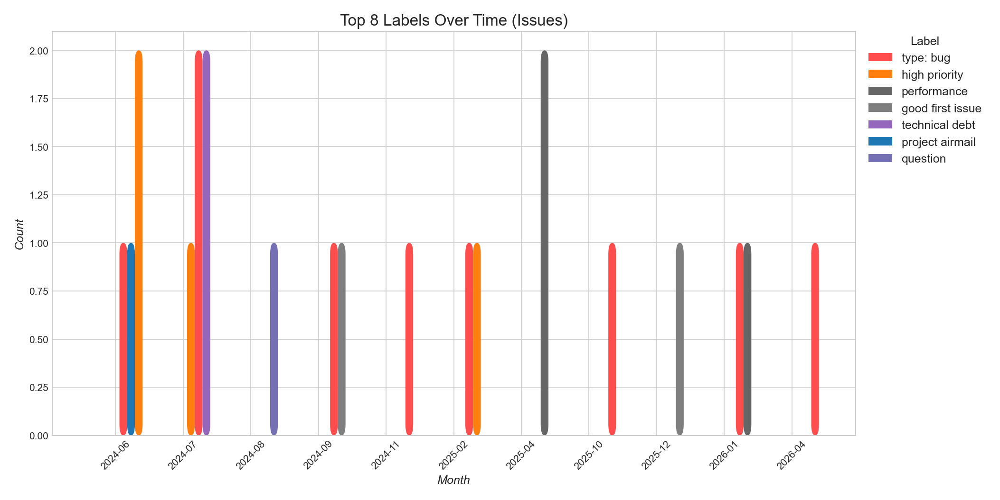
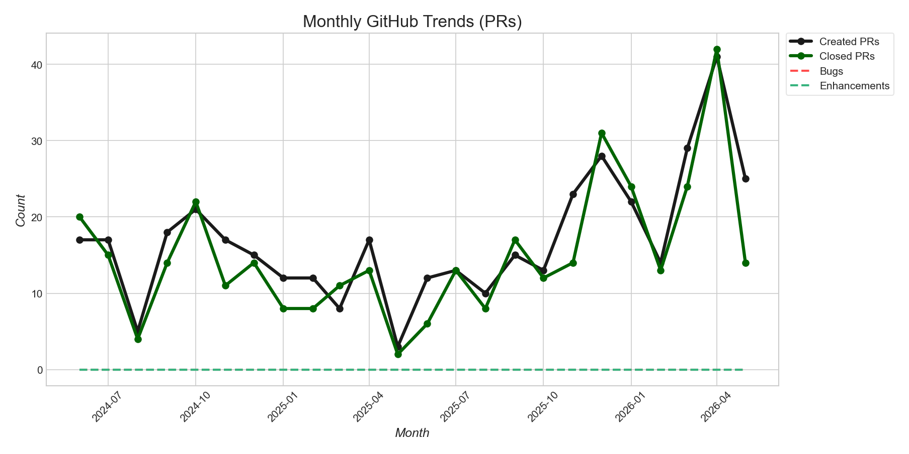
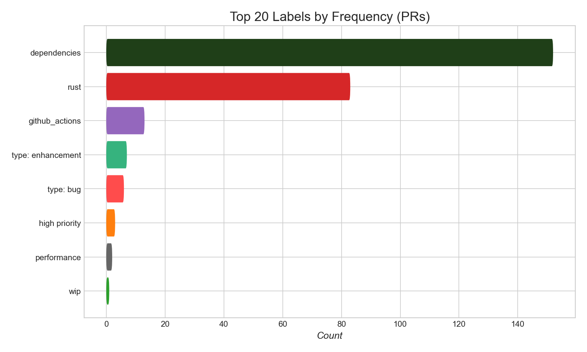
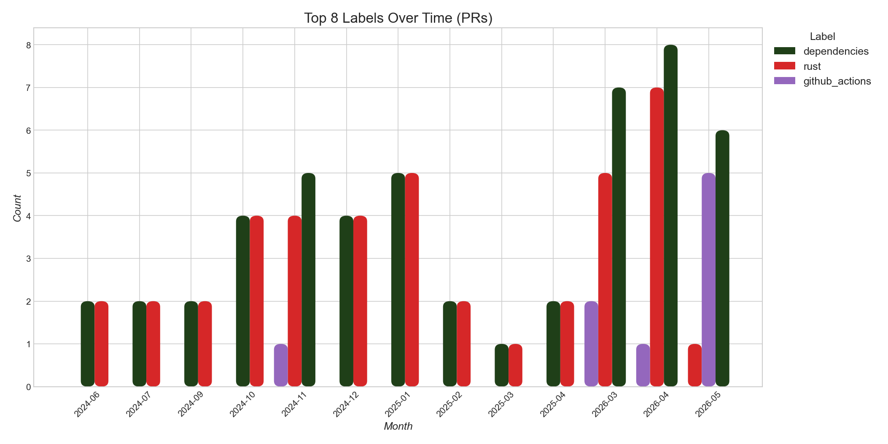
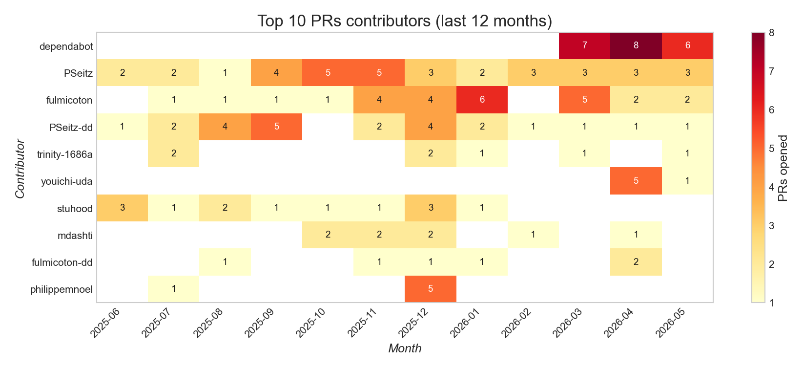
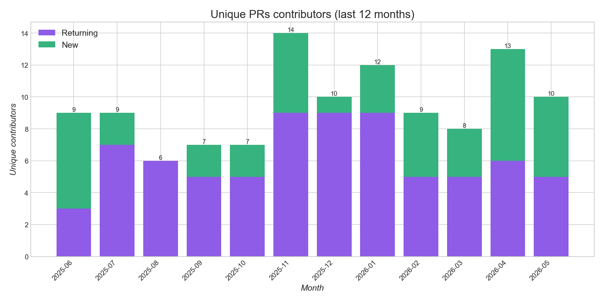
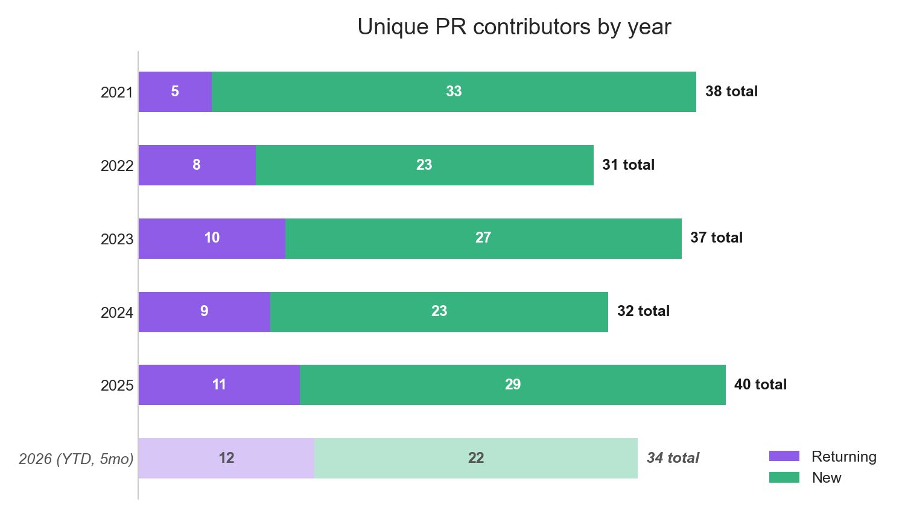

# Tantivy — Trends

[← back to README](../README.md)

## Issues

---

---

## Pull Requests

*Draft PRs excluded.*

---

*Draft PRs excluded.*

---

*Draft PRs excluded.*

---

*Draft PRs and known bot accounts excluded.*

---

**Unique PR contributors by year**

<!-- AUTO:yearly-contributors:start -->

| Year | Unique | New | Returning |
|------|--------|-----|-----------|
| 2016 | 7 | 7 | 0 |
| 2017 | 13 | 12 | 1 |
| 2018 | 20 | 18 | 2 |
| 2019 | 36 | 29 | 7 |
| 2020 | 25 | 22 | 3 |
| 2021 | 38 | 33 | 5 |
| 2022 | 31 | 23 | 8 |
| 2023 | 37 | 27 | 10 |
| 2024 | 32 | 23 | 9 |
| 2025 | 40 | 29 | 11 |
| 2026 (YTD, 5mo) | 34 | 22 | 12 |

<!-- AUTO:yearly-contributors:end -->

*Draft PRs and known bot accounts excluded.*
