# Vector — Trends

[← back to README](../README.md)

## Data notes

- **Label normalizations**: `domain: deps` is merged into `dependencies` across all label charts. Issues or PRs carrying both labels are counted once.
- **Issue type normalizations**: GitHub native issue types (`Bug`, `Feature`, `Enhancement`, `Task`) are treated as equivalent to their legacy label counterparts (`type: bug`, `type: feature`, `type: enhancement`, `type: task`). Issues carrying both are counted once.

## Issues

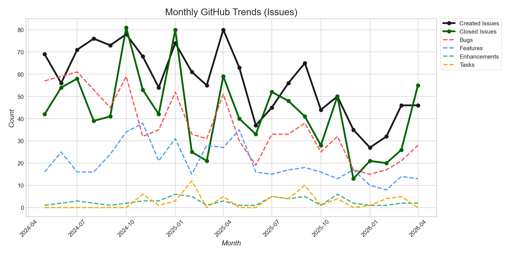

---

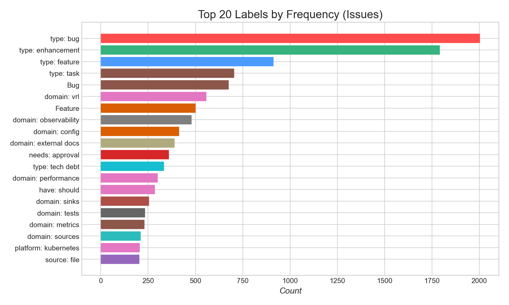

*`no-changelog` and `meta: awaiting author` series hidden.*

---

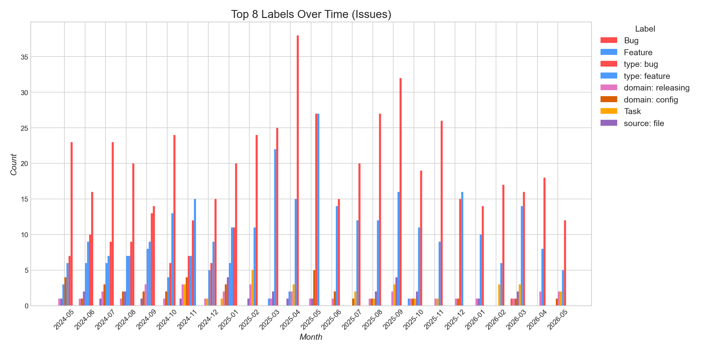

*`no-changelog` and `meta: awaiting author` series hidden.*

---

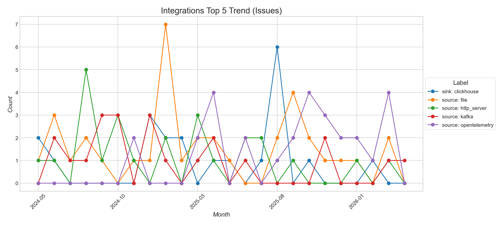

---

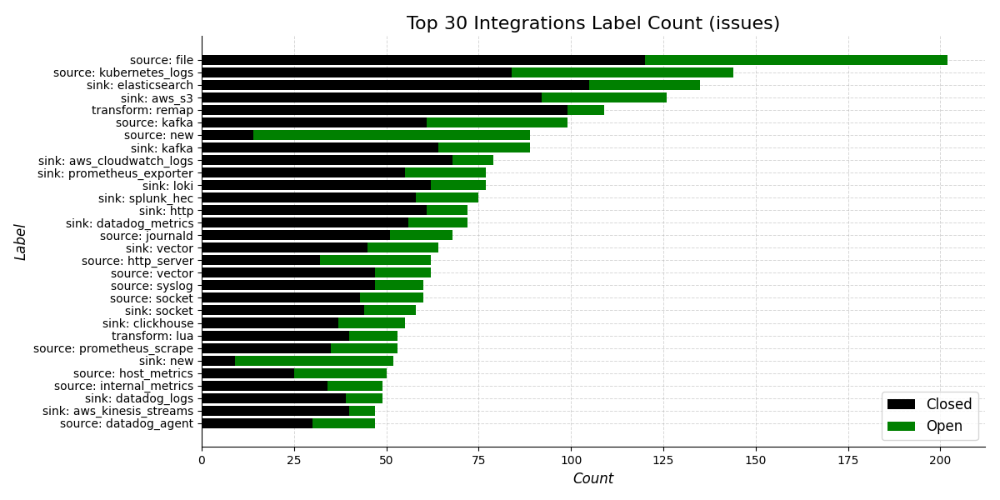

## Pull Requests

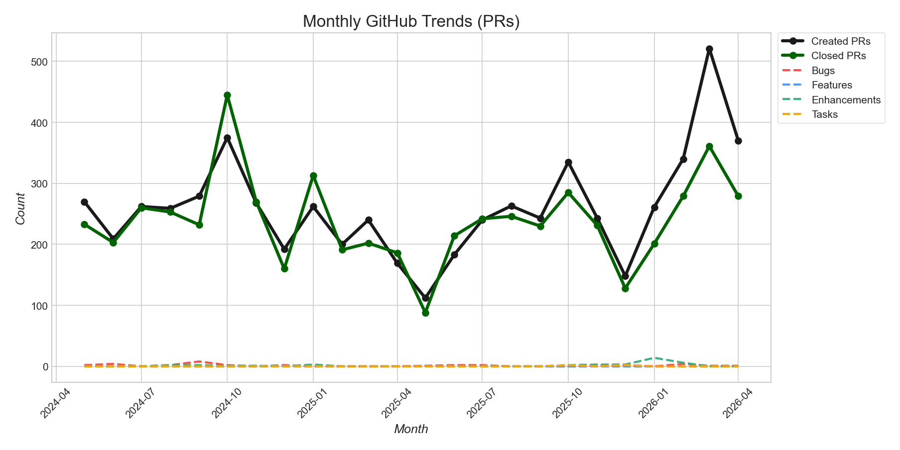

*Draft PRs excluded.*

---

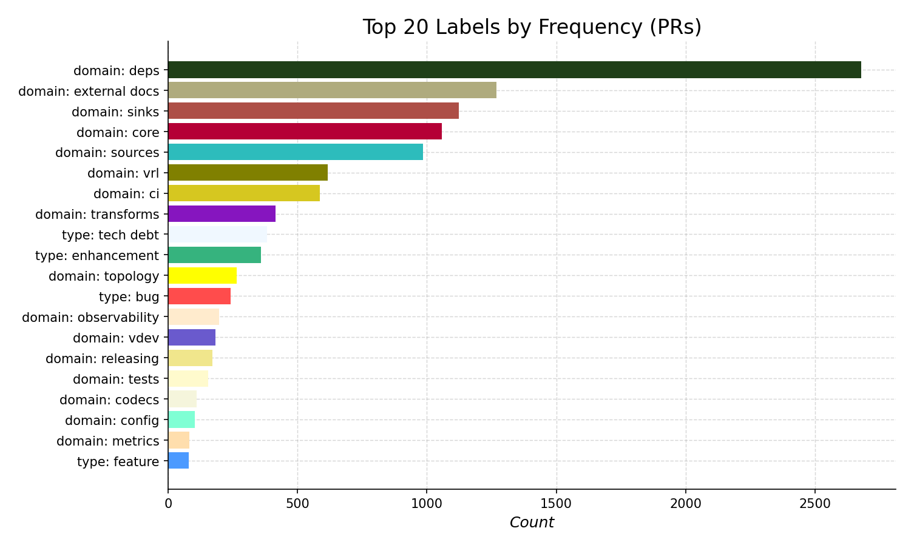

*Draft PRs excluded. `no-changelog` and `meta: awaiting author` series hidden.*

---

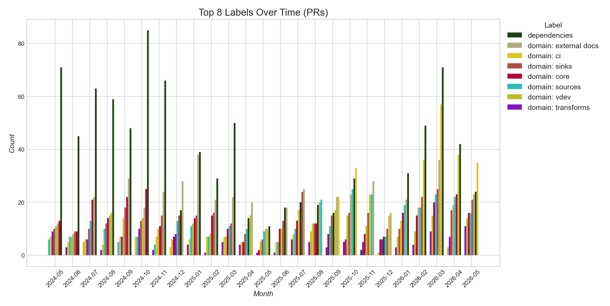

*Draft PRs excluded. `no-changelog` and `meta: awaiting author` series hidden.*

---

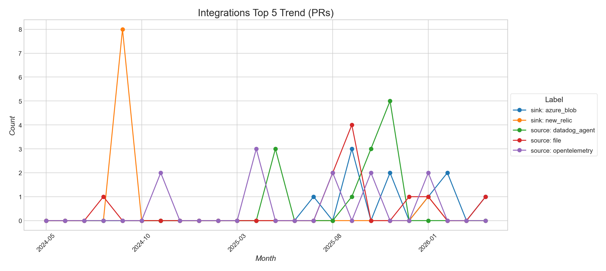

*Draft PRs excluded.*

---

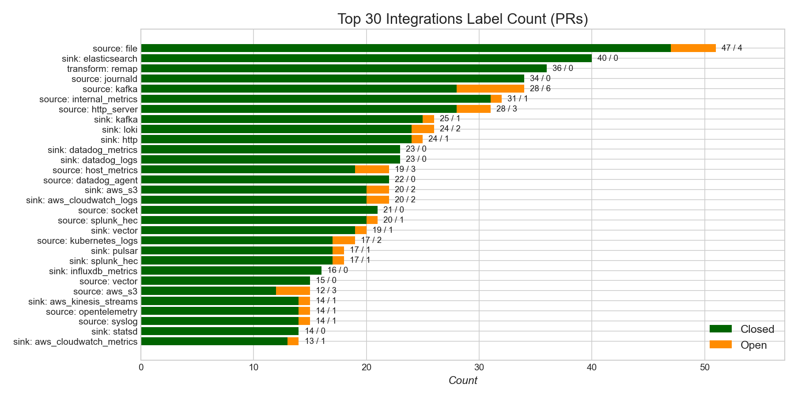

*Draft PRs excluded.*

---

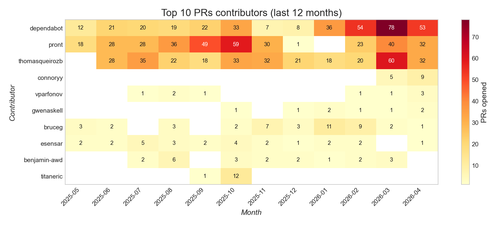

*Draft PRs and known bot accounts excluded.*

---

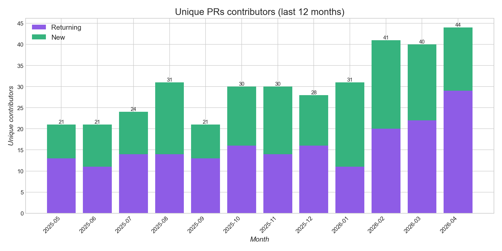

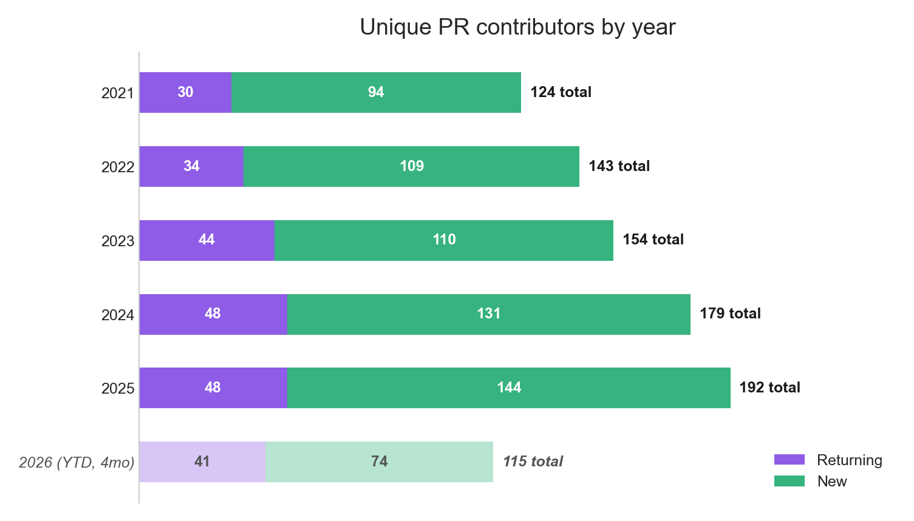

**Unique PR contributors by year**

<!-- AUTO:yearly-contributors:start -->

| Year | Unique | New | Returning |
|------|--------|-----|-----------|
| 2018 | 2 | 2 | 0 |
| 2019 | 46 | 44 | 2 |
| 2020 | 89 | 75 | 14 |
| 2021 | 124 | 94 | 30 |
| 2022 | 143 | 109 | 34 |
| 2023 | 154 | 110 | 44 |
| 2024 | 179 | 131 | 48 |
| 2025 | 192 | 144 | 48 |
| 2026 (YTD, 4mo) | 115 | 74 | 41 |

<!-- AUTO:yearly-contributors:end -->

*Draft PRs and known bot accounts excluded.*

## Discussions

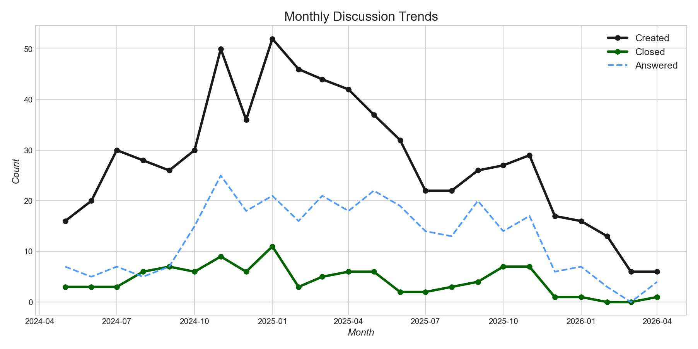

## AI-Assisted Code Review

<!-- AUTO:automated-review-stats:start -->
**All comments** (169 merged PRs, bot: `chatgpt-codex-connector`, since: 2026-01-01)

| Reaction | Count | Share |
|----------|------:|------:|
| Liked 👍 | 125 | 54.1% |
| Disliked 👎 | 26 | 11.3% |
| No signal | 80 | 34.6% |
| **Total** | **231** | |

**Reacted comments only** (excludes no signal)

| Reaction | Count | Share |
|----------|------:|------:|
| Liked 👍 | 125 | 82.8% |
| Disliked 👎 | 26 | 17.2% |
| **Total** | **151** | |
<!-- AUTO:automated-review-stats:end -->
