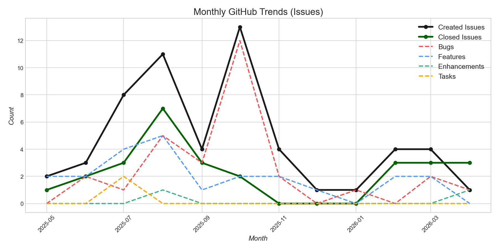
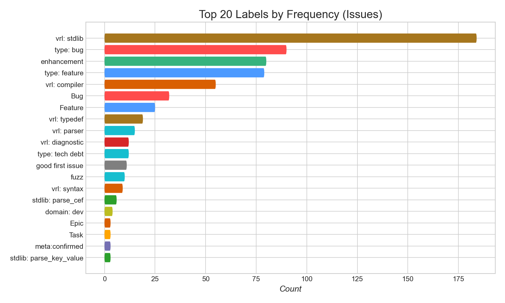
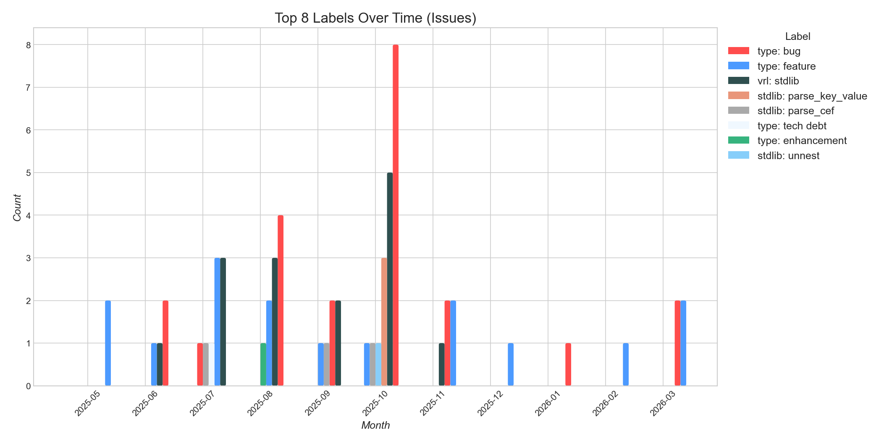
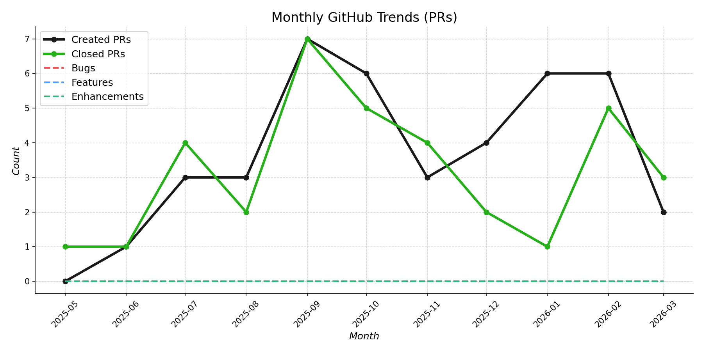
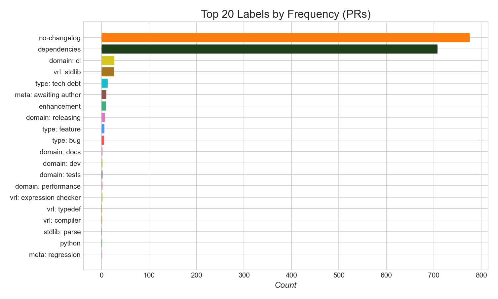
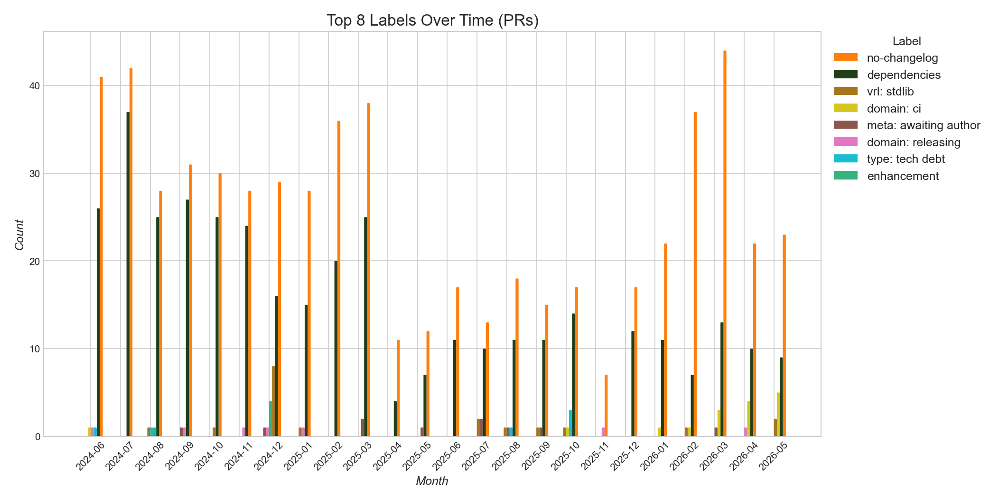
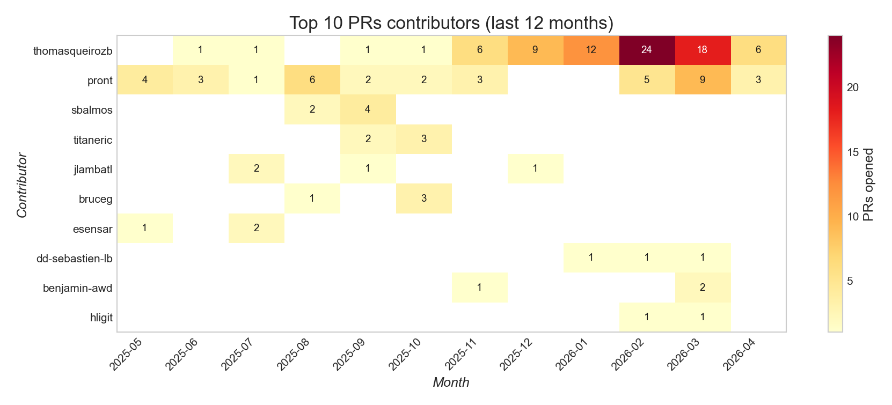
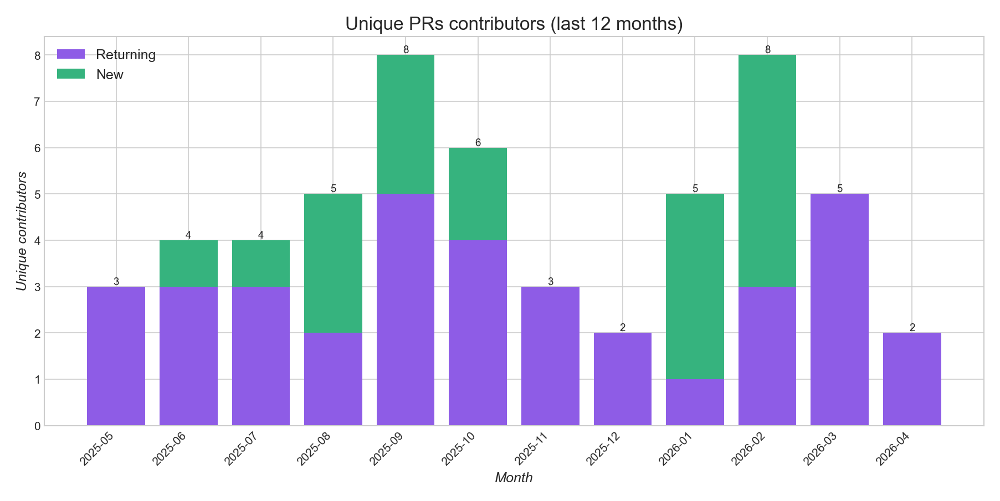
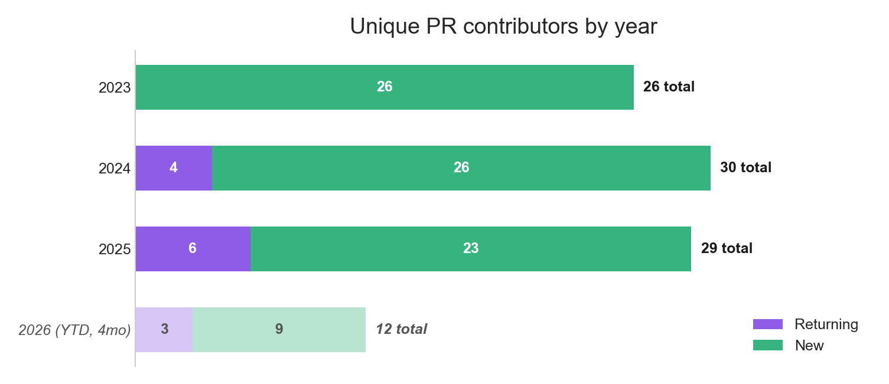
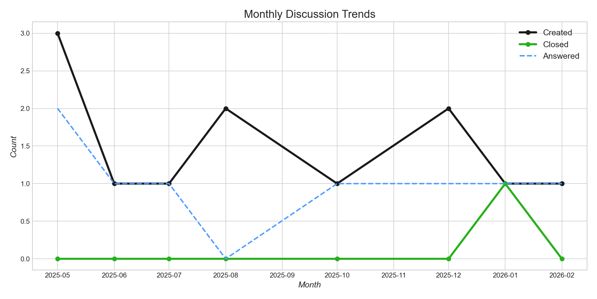

# VRL — Trends

[← back to README](../README.md)

## Issues

---

*`no-changelog` and `meta: awaiting author` series hidden.*

---

*`no-changelog` and `meta: awaiting author` series hidden.*

## Pull Requests

*Draft PRs excluded.*

---

*Draft PRs excluded. `no-changelog` and `meta: awaiting author` series hidden.*

---

*Draft PRs excluded. `no-changelog` and `meta: awaiting author` series hidden.*

---

*Draft PRs and known bot accounts excluded.*

---

**Unique PR contributors by year**

<!-- AUTO:yearly-contributors:start -->

| Year | Unique | New | Returning |
|------|--------|-----|-----------|
| 2023 | 26 | 26 | 0 |
| 2024 | 30 | 26 | 4 |
| 2025 | 29 | 23 | 6 |
| 2026 (YTD, 4mo) | 12 | 9 | 3 |

<!-- AUTO:yearly-contributors:end -->

*Draft PRs and known bot accounts excluded.*

## Discussions

